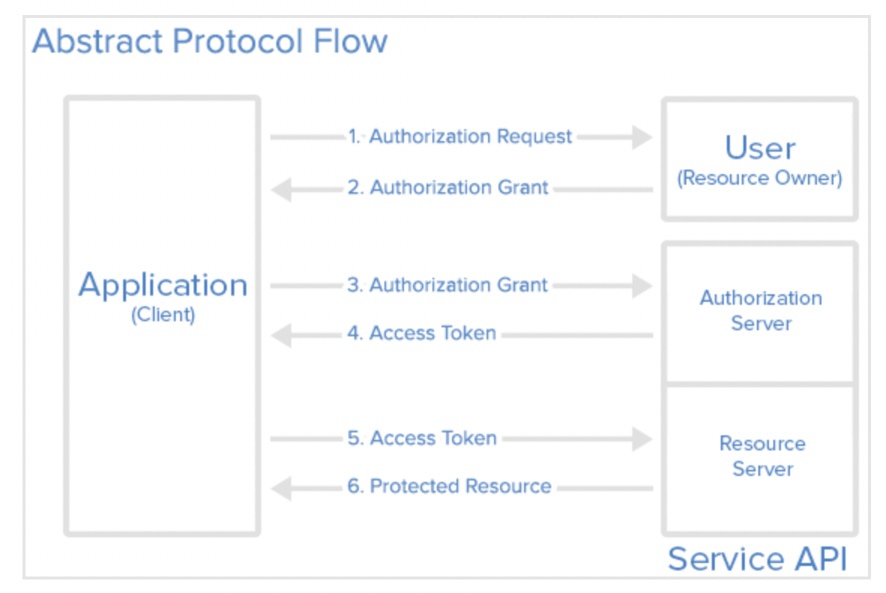

# OAuth 2.0
- [OAuth 2.0](#oauth-20)
  - [Introduction](#introduction)
  - [Main Terms](#main-terms)
  - [OAuth Role](#oauth-role)
  - [Abstract Protocol Flow](#abstract-protocol-flow)

## Introduction
* OAuth 2.0이란 사용자의 정보에 대한 권한을 부여하는 `산업 표준 프로토콜`의 일종
> 제 3의 앱이 자원의 소유자인 서비스 이용자를 대신하여 서비스를 요청할 수 있도록 자원 접근 권한을 위임하는 방법 
> `금융보안원 “OAuth 2.0 개요 및 보안 고려사항” 보안연구부-2015-030`
* 유저를 대신하여 클라이언트가 다른 서비스에 등록되어 있는 Resource에 대한 접근을 요청하는 권한을 위임
* [더 읽어보기](https://www.digitalocean.com/community/tutorials/an-introduction-to-oauth-2)

## Main Terms
* `Authentication` - 클라이언트, 유저가 인증, 접근 자격이 있는지 검증하는 과정
* `Authroization` - 유저에게 권한을 인가받은 클라이언트가 자원 접근 권한을 부여받는 과정, 클라이언트에게 리소스 접근 권한이 담긴 Access Token 발행이 수반됨
* `Access Token` - 클라이언트가 Recource Server의 자원을 획득할 때 사용해야 하는 토큰, 만료 기간 O
* `Refresh Token` - 만료 기간이 끝난 Access Token 갱신 용도로 사용되는 토큰, 만료 기간 Access < Refresh

## OAuth Role
1. Resource Owner
   - 클라이언트가 접근 인가를 요청하는 정보의 소유자 -> 유저
2. Client
   - 유저의 리소스를 요청하는 어플리케이션
3. Resource Server 
   - 유저의 정보를 소유하고 있는 서버
4. Authorization Server 
   - 클라이언트가 정보 접근 권한 grant 요청시, 사용자 검증 및 Access Token 발행 주체

---

## Abstract Protocol Flow

1. 클라이언트가 유저에게 resource 접근 권한 인가 요청
2. 유저가 클라이언트에게 권한 인가 승인
3. 클라이언트가 Authroization Server에게 Access Token 요청
4. 클라이언트, 정보 인가 승인 인증 확인 후 클라이언트에게 Access Token 발급
5. 클라이언트가 Resource Server에게 리소스 요청
6. Resource Server가 Access Token validation이후 recource를 클라이언트에게 제공

> 1, 2단계 -> 유저 - 클라: 접근 인가 과정 
> 3, 4단계 -> Auth 서버 - 클라: 사용자 인증 및 토큰 발행 과정 
> 5, 6단계 -> Resource 서버 - 클라: 리소스 요청 과정